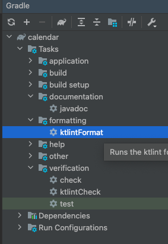
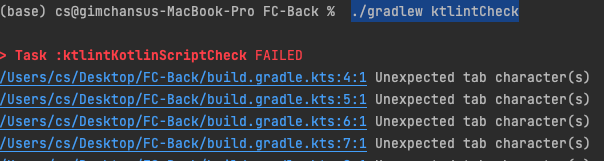

## Kotlin Lint 사용 방법

- Intellij IDE 우측에  Tasks > formatting > ktlintFormat  : 린트 적용

- Intellij IDE 우측에  Tasks > verification > ktlintCheck  : 린트에 지정한 규칙에 위반한 코드가 있는지 검사
  

또는 terminal 창을 열고 , 직접 gradle 커맨드를 통해 린트 검사를 진행하셔도 상관없습니다.

```bash
./gradlew ktlintCheck
```
- 예시 린트 검사 결과물

## ERD

- https://app.diagrams.net/#G15SRu4vcVyurTIL-ECVzgrr-0e8MTbwnq

## Directory 구조

- entity      : RDBMS Entity
- repository
- service
- controller

## Rest API


- 빌드시 자동으로 /statics/docs/index.html 파일명으로 API문서가 생성됩니다.
- 해당 문서의 템플릿을 변경하고 싶다면 `src/docs/asciidoc` 에서 문서의 템플릿을 변경할 수 있습니다.
기본적으로 파일 포맷은 adoc이며 , 마크업 문법은 다음의 사이트에서 참고 가능합니다.

아스키 문법 가이드  : https://narusas.github.io/2018/03/21/Asciidoc-basic.html

- 문서 생성 방법
```bash
./gradlew clean build
```

- 문서 조회 경로

```sql
/{서버주소}/docs/index.html
```

## Querydsl
-  Compile 방법
```bash
./gradlew clean compileKotlin
```
